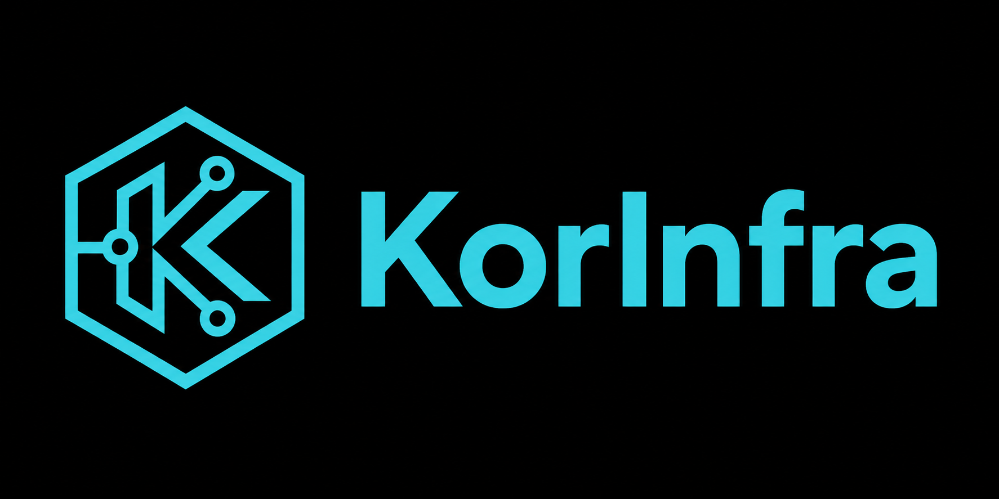

<div align="center">



**Your AWS bill has waste. KorInfra finds it in minutes.**

[](https://github.com/korinfra/korinfra/actions/workflows/ci.yml)
[](https://www.npmjs.com/package/korinfra)
[](https://www.npmjs.com/package/korinfra)
[](LICENSE)
[](https://nodejs.org)

</div>

---

```bash
npm install -g korinfra

korinfra          # interactive TUI — menu-driven, keyboard-driven
korinfra init     # first-time setup: AWS profile + AI key (60 seconds)
korinfra scan     # full cost + security scan
```

> **Requirements:** Node.js ≥ 22 · [AWS credentials configured](https://docs.aws.amazon.com/cli/latest/userguide/cli-configure-files.html) · [Getting started →](docs/getting-started.md)

---

## Features

- **No AI key needed.** 66 cost rules and 46 security rules run entirely locally — no API calls, $0. Add a Claude API key to unlock natural language explanations, free-form `/` chat, and Terraform patch generation.

- **Terraform-aware.** A 4-pass matcher (ARN → ID → name tag → fuzzy) links every live AWS resource to its `.tf` definition. `korinfra fix` edits the right file and opens a GitHub PR — no manual hunting.

- **Data stays local.** Everything stored in a local SQLite database. The only data that ever leaves is redacted findings sent to your AI provider. Credentials, ARNs, IPs, and email addresses are stripped automatically.

- **CI/CD ready.** `korinfra scan --json --fail-on critical` exits 1 on critical findings. Auto-detected in CI — zero AI cost in headless mode.

- **MCP server.** `korinfra mcp` registers a server in Claude Code or Cursor. Ask your editor *"which EC2 instances are idle?"* — KorInfra runs live analysis and returns results inline.

---

## What it catches

**66 cost rules** across EC2, RDS, EBS, S3, Lambda, ECS, ELB, ElastiCache, DynamoDB, and NAT Gateway — plus **46 security rules** on your Terraform config.

| Rule | Finding | Typical saving |
|---|---|---|
| EC2-001 | Instance with <5% CPU for 7+ days | $50–400/mo |
| EC2-003 | m4/c4/r4 family — faster current-gen is cheaper | $20–200/mo |
| RDS-007 | Multi-AZ on dev/staging — disable and halve the cost | $100–3000/mo |
| EBS-001 | Unattached volumes still billing | $5–50/mo each |
| EBS-003 | gp2 → gp3 migration — 20% cheaper, same performance | $10–100/mo |
| LAM-001 | Lambda with zero invocations | < $5/mo |
| S3-004 | Bucket without server-side encryption (SSE-S3 is free) | — |
| RDS-005 | Publicly accessible RDS instance | — |

Plus: cost anomaly detection (z-score) and 30-day trend forecasting. [Full rule list →](docs/rules.md)

---

## Commands

| Command | What it does |
|---|---|
| *(no args)* | Interactive TUI — menu-driven, keyboard-driven |
| `scan` | Full cost + security scan |
| `fix` | AI reads Terraform, generates patch, opens GitHub PR *(AI required)* |
| `security` | 46 Terraform security rules — `--dir <path>` |
| `costs` | Cost Explorer breakdown — `--days N`, `--group-by service\|region\|tag` |
| `recommend` | Review saved recommendations — `--refresh` re-runs analysis |
| `report` | Export to JSON, CSV, or HTML with inline SVG charts |
| `mcp` | Install MCP server into Claude Code or Cursor |

<details>
<summary>All commands</summary>

| Command | What it does |
|---|---|
| `resources` | Browse and filter all scanned resources |
| `changes` | Audit recent AWS API activity (CloudTrail) |
| `history` | Browse past scans, diff between them |
| `tags` | Audit required tags — `suggest` uses AI |
| `pricing` | Inspect or refresh the local AWS pricing cache |
| `init` | Setup wizard — AWS profile, AI provider, API key |
| `doctor` | Verify credentials, config, storage, and AI provider |
| `config` | View or edit config values at runtime |
| `serve` | Start MCP server — `stdio` (default) or `--http --port N` |
| `rules` | List built-in cost optimization rules — `list --json`, `list --filter <category>` |

</details>

Press `/` from the main menu to ask your AI assistant anything about your infrastructure.

---

## Applying fixes

Run `korinfra fix`, select a recommendation, and the AI agent:

1. Reads your Terraform files to locate the resource
2. Generates a minimal, targeted patch
3. Runs `terraform validate` to verify the change
4. Shows exactly what will change before applying
5. Optionally creates a GitHub PR

Every change is shown for review before anything is written. No AWS API calls are made. Rollback is reverting the file.

---

## Interactive TUI

Run `korinfra` with no arguments to launch the full interactive menu — built with Ink 6 + React 19, the same stack as Claude Code and Gemini CLI.

| Key | Action |
|---|---|
| <kbd>↑</kbd> <kbd>↓</kbd> | Navigate |
| <kbd>Enter</kbd> | Drill into recommendation |
| <kbd>Esc</kbd> | Go back |
| <kbd>/</kbd> | Free-form AI question |
| <kbd>f</kbd> | Generate Terraform fix |
| <kbd>p</kbd> | Export report |

After a scan, a follow-up panel stays open so you can ask questions in the same session.

---

## CI/CD

```bash
korinfra scan --json | jq '.summary'
korinfra security --json --dir ./terraform --fail-on critical   # exits 1 on critical
CI=true korinfra scan --json > scan.json
```

[Full reference + GitHub Actions example →](docs/usage.md)

---

## KorInfra vs. alternatives

| | KorInfra | AWS Trusted Advisor | Infracost | Checkov |
|---|---|---|---|---|
| AI reasoning — not just rules | ✓ | — | — | — |
| Cost optimization — live infra | 66 rules | Limited | Pricing only | — |
| Security scanning | 46 rules | ✓ | — | 1000+ rules |
| Cost anomaly detection | ✓ | — | — | — |
| MCP server for AI editors | ✓ | — | — | — |
| Natural language questions | ✓ | — | — | — |
| Data stays local | ✓ | — | Partial | ✓ |
| Generates Terraform fixes + PRs | ✓ | — | — | — |

---

## Reference

<details>
<summary><strong>AWS Permissions — minimal read-only IAM policy</strong></summary>

```json
{
  "Version": "2012-10-17",
  "Statement": [
    {
      "Sid": "korinfraReadOnly",
      "Effect": "Allow",
      "Action": [
        "ec2:DescribeInstances", "ec2:DescribeVolumes", "ec2:DescribeSnapshots",
        "ec2:DescribeAddresses", "ec2:DescribeNatGateways",
        "rds:DescribeDBInstances",
        "s3:ListAllMyBuckets", "s3:GetBucketLocation", "s3:GetBucketVersioning",
        "s3:GetBucketEncryption", "s3:GetBucketLifecycleConfiguration",
        "s3:ListBucketIntelligentTieringConfigurations", "s3:GetBucketTagging",
        "lambda:ListFunctions", "tag:GetResources",
        "ecs:ListClusters", "ecs:ListServices", "ecs:DescribeServices", "ecs:DescribeClusters",
        "elasticloadbalancing:DescribeLoadBalancers", "elasticloadbalancing:DescribeTargetGroups",
        "elasticloadbalancing:DescribeTargetHealth", "elasticloadbalancing:DescribeTags",
        "elasticache:DescribeCacheClusters", "elasticache:ListTagsForResource",
        "dynamodb:ListTables", "dynamodb:DescribeTable", "dynamodb:ListTagsOfResource",
        "cloudwatch:GetMetricStatistics", "cloudwatch:GetMetricData",
        "ce:GetCostAndUsage", "sts:GetCallerIdentity", "pricing:GetProducts"
      ],
      "Resource": "*"
    }
  ]
}
```

KorInfra never modifies AWS resources. `fix` edits local Terraform files only.

</details>

<details>
<summary><strong>Configuration</strong></summary>

`korinfra init` creates config automatically. To customize:

```yaml
# .korinfra/config.yaml
aws:
  default_profile: production
  default_region: us-east-1

ai:
  provider: claude                       # "none" for rules-only mode
  model: claude-haiku-4-5-20251001       # or claude-sonnet-4-6 for deeper analysis

scan:
  lookback_days: 30
  idle_cpu_threshold: 5
  required_tags: [Environment, Team, Project]
```

[Full reference →](docs/configuration.md)

</details>

<details>
<summary><strong>Privacy & redaction</strong></summary>

| Level | What is stripped |
|---|---|
| `minimal` | AWS access keys, API keys, GitHub tokens, JWTs, PEM keys |
| **`moderate`** (default) | + ARN account IDs, public IPs, email addresses |
| `strict` | + private IPs, external domain names |

No telemetry. Local SQLite only. MCP HTTP server binds to localhost (plain HTTP — see [SECURITY.md](SECURITY.md) for remote-access guidance).

</details>

<details>
<summary><strong>Architecture</strong></summary>

Three layers in sequence:

1. **Collect** — AWS SDK v3 pulls live state from 9 services in parallel. CloudWatch adds utilization metrics; Cost Explorer adds spend data.
2. **Analyze** — 66 cost + 46 security rules run locally — no AI, no network. 4-pass Terraform matcher compares resources against `.tf` files. Z-score anomaly detection flags spending spikes.
3. **Output** — Data is redacted, then the AI agent produces summaries and generates fixes. Output goes to the TUI, file export (JSON/CSV/HTML), or an MCP client.

TypeScript 6 · Ink 6 + React 19 · Claude Agent SDK · AWS SDK v3 · better-sqlite3 · Zod 4

[Full architecture →](docs/architecture.md)

</details>

---

## FAQ

**Do I need an AI key?** No — all 112 rules run locally. Add a key to unlock `/` chat, explanations, and `fix`.

**Does it modify AWS resources?** Never. Read-only against AWS. `fix` edits local Terraform files only.

**Do I need Terraform?** No. Terraform features activate automatically when `.tf` files are found.

**Is my data sent to AI?** Only redacted findings — account IDs, ARNs, IPs, and emails stripped first.

**Multiple AWS accounts?** Not yet. Single account in v0.1.0; multi-account is planned.

**Cost to run?** ~$0.02/scan (Cost Explorer API) + ~$0.01 AI. Rules-only: $0.00. [Breakdown →](docs/running-costs.md)

---

## Contributing

- [CONTRIBUTING.md](CONTRIBUTING.md) — setup, conventions, good first issues
- [Open an issue](https://github.com/korinfra/korinfra/issues) — bugs, ideas, questions

```bash
git clone https://github.com/korinfra/korinfra
cd korinfra && npm install
npm run dev              # interactive TUI (no build step)
npm run check            # typecheck + lint + test
```

---

## License

Apache 2.0 — see [LICENSE](LICENSE).
