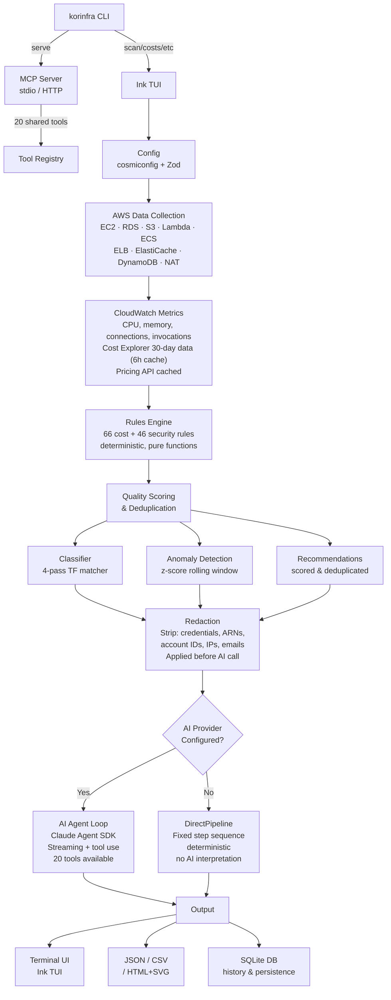
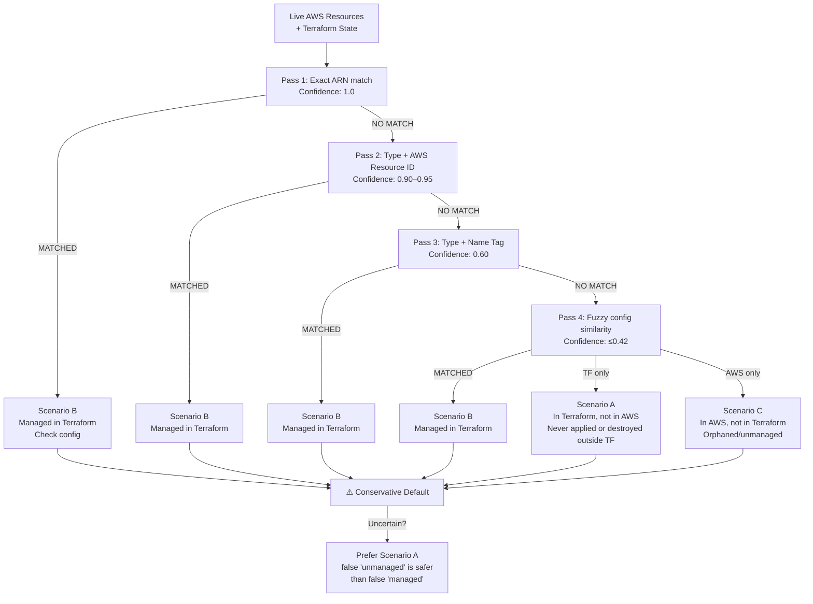
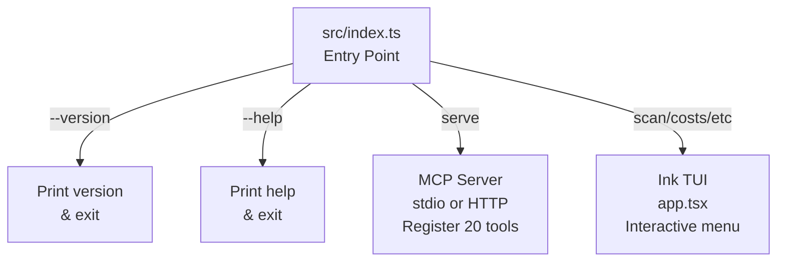
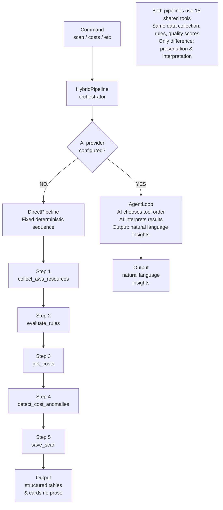
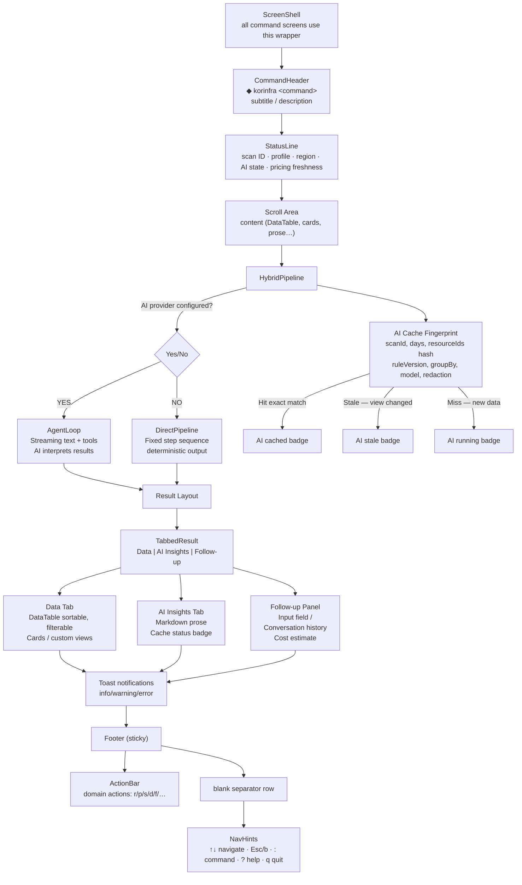

# Architecture

## Overview

korinfra works in three stages:

1. **Collect** — AWS SDK v3 collectors pull live resource state from 9 services. CloudWatch adds CPU/memory/connection metrics; Cost Explorer adds spending data. Everything is rate-limited and logged.
2. **Analyze** — 66 cost rules + 46 security rules evaluate resources locally (no network, no AI). The 4-pass Terraform matcher compares live AWS resources against `.tf` files. Z-score anomaly detection flags spending spikes.
3. **Report** — Data is redacted (credentials, IPs, emails stripped), then the AI agent synthesizes findings into prioritized, explainable recommendations and optionally generates Terraform patches.

When no AI provider is configured, the same analysis runs deterministically — same rules, same data — with structured table output instead of AI prose.

### Data flow



### 4-pass Terraform matcher



### Entry point routing



---

## Module map

| Directory | Responsibility |
|---|---|
| `src/index.ts` | Entry: route `--version` / `serve` / TUI |
| `src/cli/` | Ink TUI — `app.tsx`, commands, components, hooks |
| `src/agent/` | AI provider abstraction, tool registry, system prompts |
| `src/aws/` | AWS SDK v3 collectors, credentials, CloudWatch, Cost Explorer, CloudTrail, rate limiter |
| `src/rules/` | 66 cost rules + 46 security rules (pure deterministic functions) |
| `src/classifier/` | 4-pass matcher, config comparison, rightsizing, dedup |
| `src/anomaly/` | Z-score anomaly detection + linear regression trend forecasting |
| `src/terraform/` | HCL parser (`@cdktf/hcl2json`), `.tfstate` parser (v3/v4) |
| `src/tools/` | 20 MCP tools shared by agent mode and MCP server mode (19 in allTools registry + 1 excluded destructive tool) |
| `src/mcp/` | MCP server (stdio + HTTP), resources, prompts |
| `src/output/` | File export: JSON, CSV, HTML (with inline SVG charts) |
| `src/pricing/` | AWS Pricing API client + SQLite-backed cache |
| `src/redaction/` | 3-level redaction applied before all AI calls |
| `src/storage/` | SQLite DB with migrations, query modules per entity |
| `src/config/` | cosmiconfig + Zod v4 validation, defaults, path expansion |
| `src/github/` | GitHub REST client for PR creation after `fix` |
| `src/utils/` | logger (pino), humanize, retry (exponential backoff + jitter), version |

---

## AI agent loop

### Provider abstraction (`src/agent/`)

korinfra uses the **Claude Agent SDK** (`@anthropic-ai/claude-agent-sdk` v0.2.109) as its primary AI provider. The agent loop is fully streaming — events include `thinking`, `text`, `tool_start`, `tool_end`, `result`, `error`, `cost_update`.

Tools are exposed to the agent as an **in-process MCP server** (`createSdkMcpServer`) — no subprocess, no network hop, no serialization overhead. The agent calls the same 20 tools that the MCP server exposes externally (19 in the allTools registry; `apply_tags_real` is excluded from MCP and only called via TUI confirmation).

The default model is `claude-haiku-4-5-20251001`, configurable via `ai.model` in your config file or the `KORINFRA_AI__MODEL` environment variable.

**Default permissions:**

- Always allowed: `Read`, `Glob`, `Grep` (read-only filesystem)
- Allowed in `fix` mode only: `Edit`, `Write`
- Always denied: `Bash`, `WebSearch`, `WebFetch`

**Configurable limits (via `ai.*` in config):**

- `ai.max_tokens` — max output tokens per query (default 16384)
- `ai.thinking_budget` — extended thinking token budget (default 0)
- `ai.confirm_threshold_usd` — show confirmation before calls estimated above this USD cost (default $0.01)
- `ai.confirm_threshold_sec` — show confirmation before calls estimated above this duration in seconds (default 10)

### System prompts (`src/agent/prompts.ts`)

Each command has a dedicated system prompt:

| Command | Prompt focus | Default Model |
|---|---|---|
| `scan` | Full cost + security analysis with ordered execution steps | claude-haiku-4-5-20251001 |
| `costs` | Cost trend analysis and anomaly interpretation | claude-haiku-4-5-20251001 |
| `fix` | Terraform HCL patch application with safety rules | claude-haiku-4-5-20251001 |
| `security` | Severity-classified security posture (CRITICAL/HIGH/MEDIUM/LOW) | claude-haiku-4-5-20251001 |
| `recommend` | Targeted recommendations with DB persistence | claude-haiku-4-5-20251001 |
| `general` | Interactive FinOps assistant | claude-haiku-4-5-20251001 |

---

## Direct Pipeline (rules-only mode)

When `ai.provider` is `none` (or no API key is set), commands use the **DirectPipeline** component instead of the AI AgentLoop. This runs the same tool handler functions in a fixed, deterministic sequence:



Each pipeline is defined in `src/cli/pipelines/`:

| Pipeline | File | Steps |
|----------|------|-------|
| Scan | `pipelines/scan.ts` | collect → rules → costs → anomalies → save |
| Costs | `pipelines/costs.ts` | get_costs (daily) → get_costs (by service) → anomalies |
| Resources | `pipelines/resources.ts` | collect → rules (for annotations) |
| Security | `pipelines/security.ts` | scan_security |
| Tags | `pipelines/tags.ts` | collect → tag compliance check |
| Report | `pipelines/report.ts` | DB read → format → file export |
| History | `pipelines/history.ts` | DB reads (list/show/diff) |

The DirectPipeline shows step-by-step progress with spinners, handles errors with `ErrorBox`, and calls a command-specific `renderResult` function when all steps complete.

**Key design decision:** Pipelines call tool handler functions directly (e.g., `collectAwsTool.handler({...})`), reusing all existing input validation and JSON serialization. No tool code is duplicated.

---

## TUI layer (`src/cli/`)



### Screen layout reference

Every command screen produced by `ScreenShell` follows this fixed vertical layout:

```
┌─────────────────────────────────────────────────────┐
│ ◆ korinfra <command>           [status badge]       │  ← CommandHeader (row 1)
│ <subtitle / description>                             │  ← subtitle (row 2)
│                                                      │  ← GAP_AFTER_HEADER
│  ... scroll area (DataTable / cards / markdown) ...  │
│                                                      │
│                                                      │  ← GAP_BEFORE_ACTIONS
│  r run again  s scan  p report  d delete  ? help     │  ← ActionBar (domain keys)
│                                                      │  ← blank separator
│  ↑↓ navigate · b back · : command · ? help · q quit  │  ← NavHints (nav keys only)
└─────────────────────────────────────────────────────┘
```

Key conventions enforced by `ScreenShell`:

- **Header prefix** — always `◆ korinfra <command>`. The diamond (◆) is part of the brand; never omit it.
- **Status badge** — right-aligned on the header row. Shows scan source and AI state:
  - `source: AWS · AI running` (scan in progress)
  - `source: AWS · AI cached` (result from AI cache)
  - `source: local · rules only` (no AI provider)
- **Footer separation** — `ActionBar` and `NavHints` are always separated by one blank row. `ActionBar` is second-to-last; `NavHints` is always last.
- **Key placement** — domain/action keys (`r`, `s`, `p`, `d`, `f`, `o`, `g`, …) belong in `ActionBar` only. Navigation keys (`↑↓`, `Esc`, `b`, `:`, `?`, `q`) belong in `NavHints` only. The `r` key never appears in `NavHints`.
- **Cancel vs back** — while a pipeline or AI call is running the footer shows `Esc cancel`; once the operation completes it switches to `b back`.
- **Progress format** — during DirectPipeline steps, the scroll area shows a dotted progress bar followed by a spinner line:

  ```
  Collecting data ···  0%   0/6 phases
  ↳ EC2 ✓ 412ms · RDS ✓ 891ms · 4 remaining
  ```

### Shared UI primitives

| File | Exports |
|---|---|
| `ui/spacing.ts` | `PADDING_X`, `GAP_ROW`, `GAP_AFTER_HEADER`, `GAP_BETWEEN_SECTIONS`, `GAP_BEFORE_ACTIONS`, `NARROW_THRESHOLD`, `COMPACT_THRESHOLD` |
| `ui/text.ts` | `DOT_SEP`, `SEVERITY_LABELS`, badge constants (`BADGE_AI_CACHED`, `BADGE_AI_STALE`, `BADGE_AI_RUNNING`, `BADGE_AI_OFF`, `BADGE_AI_UNAVAILABLE`, `BADGE_LOCAL`, `BADGE_DIAGNOSTIC`, `BADGE_SETUP`, …), `MODE_LABELS`, `CMD_DESCRIPTIONS` |
| `ui/format.ts` | `formatScanIdShort`, `formatMoney`, `formatMoneyPerMonth`, `formatTimestamp`, `formatRegionList` |
| `ui/keys.ts` | `RESERVED_KEYS`, `IH_HELP_LABEL`, `MODE_LABEL_MAP` — G-5 key contract and hint label constants |
| `theme.ts` | `colors.*`, `semanticColors.severity`, `semanticColors.status`, `semanticColors.ai`, `semanticColors.cost`, `semanticColors.savings` |

### Shared components

| Component | Purpose |
|---|---|
| `ScreenShell` | Consistent CommandHeader + padding + sticky footer wrapper for all command screens |
| `HybridPipeline` | Orchestrates AgentLoop vs DirectPipeline; manages tab state (Tab/Shift+Tab); AI cache (fingerprint → `AiInsight`) |
| `AgentLoop` | Streaming AI agent execution; delegates follow-up to `FollowUpPanel` |
| `DirectPipeline` | Deterministic step runner for rules-only mode |
| `TaskProgress` | Phased progress (completed ✓ / current → / pending ○) with substep, elapsed time, retry messages, and AI provider+cost context |
| `StatusLine` | Single-row trust strip: `scan 8bbd1846 · profile default · region eu-north-1 · AI cached $0.021 · pricing fresh 2m` |
| `DataTable` | Generic table with priority-based column hiding on narrow terminals, fixed row heights, middle-ellipsis for long paths, sort indicators, and row count/position display |
| `FilterOverlay` | Keyboard-driven filter form (text/select/boolean fields); Enter apply, Esc cancel, c clear all; does not trigger AWS or AI calls |
| `TabbedResult` | Tab strip without numeric prefix shortcuts; Tab/Shift+Tab navigation only |
| `FollowUpPanel` | Follow-up input with conversation history, scan context, and pre-send cost estimate |
| `SafeWriteReview` | Pre-write review: Will change / Will not change / Data used / Safety (dry-run, rollback) |
| `WizardShell` | Multi-step wizard with stepper, back/cancel semantics, and per-step validation |
| `Toast` / `useToast` | info/success/warning/error notifications; 3s auto-expire for info/success; persistent for error; max 3 visible |
| `ResultPanel` | Markdown-to-Ink renderer; preserves spaces between adjacent styled tokens |
| `CommandPaletteOverlay` | `:` command palette — unified with `commandRegistry.ts` |

### Command registry

`src/cli/commandRegistry.ts` exports `COMMAND_REGISTRY` (array) and `KNOWN_COMMAND_IDS` (string union). The menu, command palette, help overlay, and router all consume this single registry — no duplicate `KNOWN_COMMANDS` arrays.

### Key contracts

**VRHYTHM_RULE** — vertical rhythm uses exactly three constants: `GAP_AFTER_HEADER`, `GAP_BETWEEN_SECTIONS`, `GAP_BEFORE_ACTIONS`. No other `marginTop`/`marginBottom` values.

**G-5 key contract** — global key reservations: `r`=run-again, `p`=report, `s`=scan, `d`=doctor/diff/delete, `?`=help overlay, `:`=command palette.

**X-1 rule** — `NavHints` contains navigation-only keys. Domain actions go in `ActionBar`.

**G-2 rule** — `renderResult` returns `CommandResultView`; `ActionBar` is never placed inside `items[]`.

### AI cache

`HybridPipeline` maintains `aiInsightCache: Map<string, AiInsight>`. The cache key (fingerprint) is derived from `{ scanId, days, resourceIds hash, ruleVersion, groupBy (for view-scoped insights), model, redactionLevel }`. Cache hits are classified as:

- `AI cached` — exact fingerprint match
- `AI stale` — dataset matches but view differs (e.g. groupBy changed)
- `AI running` — request in flight
- `AI off` — no provider configured

GroupBy changes, tab switches, sorts, scrolls, and local filters do **not** invalidate the cache. Only `r refresh AI`, data changes, or `Shift+R` force-refresh trigger a new AI call.

---

## AWS collectors (`src/aws/collectors/`)

All collectors use AWS SDK v3. Every API call is logged to the `api_call_log` SQLite table via the rate limiter.

| Collector | AWS APIs used | Key data collected |
|---|---|---|
| `ec2.ts` | EC2 `DescribeInstances`, `DescribeVolumes`, `DescribeSnapshots`, `DescribeAddresses` | Instance state, type, AMI, EBS volumes, Elastic IPs |
| `rds.ts` | RDS `DescribeDBInstances` | Engine, class, encryption, Multi-AZ, backup, storage |
| `s3.ts` | S3 `ListBuckets`, lifecycle, versioning, encryption, intelligent tiering APIs; CloudWatch `BucketSizeBytes` metric | Bucket configuration; `size_bytes`/`size_gb` populated for pricing (Standard storage estimated at $0.023/GB) |
| `lambda.ts` | Lambda `ListFunctions`, `ResourceGroupsTaggingAPI GetResources` (bulk tags), CloudWatch invocations/errors | Runtime, memory, architecture; tags fetched in a single bulk call (O(1) instead of N+1 `ListTags`) |
| `ecs.ts` | ECS `ListClusters`, `DescribeServices`, CloudWatch CPU | Launch type, running/desired counts |
| `elb.ts` | ELB `DescribeLoadBalancers`, target health, CloudWatch | Type, scheme, healthy targets |
| `elasticache.ts` | ElastiCache `DescribeCacheClusters`, CloudWatch | Node type, engine, memory utilization |
| `dynamodb.ts` | DynamoDB `ListTables`, `DescribeTable`, auto-scaling | Billing mode, capacity settings |
| `nat.ts` | EC2 `DescribeNatGateways`, CloudWatch | Data processed, connectivity type |

**Rate limiting:** `p-throttle` per service with exponential backoff + jitter (`src/utils/retry.ts`). `ResourceGroupsTaggingAPIClient` calls are rate-limited at 5 req/s (`tagging` bucket in `rate-limiter.ts`).

**Pagination:** All collectors use the generic `paginate<TOut, TItem>(call, getToken, collect)` helper from `src/aws/utils.ts` instead of inline do-while loops.

**Cost Explorer caching (`src/aws/cost-explorer.ts`):** Cost Explorer calls are cached for 6 hours to a JSON file (`~/.korinfra/ce_cache.json`). In-flight dedup via `_ceInFlight: Map<string, Promise>` ensures concurrent callers share one pending fetch instead of each making separate API calls. The `includeResourceCosts` option (default `false`) controls whether per-resource cost data is fetched; only the resource collector sets this to `true` for cost enrichment. Pagination is bounded at `CE_MAX_PAGES=100` via the generic `paginateAll` helper (`src/utils/pagination.ts`); when the cap is hit, the `partial: true` flag is propagated through `getCostsCached` → `collector.ts` (`CollectError` with `code: 'CostExplorerTruncated'`) → the `get_costs` MCP tool (`costExplorerPartial` field). The S3 region cache (`src/aws/collectors/s3.ts`) uses the bounded `LruTtl` (`src/utils/lru-ttl.ts`) capped at 1000 entries with a 6 h TTL to prevent unbounded growth during long-running `mcp serve` sessions.

**CloudTrail auditing (`src/aws/cloudtrail.ts`):** Provides the `get_changes` tool for the `changes` command. Queries CloudTrail events within a configurable time window (24h/48h/7d), filters by user/IAM role or resource type, and surfaces recent API activity. Rate-limited via the standard `cloudtrail` bucket. All API calls are logged to `api_call_log`.

**Tag writer (`src/aws/tag-writer.ts`):** Backs the `apply_tags_real` tool (excluded from public MCP registry). Applies Resource Groups Tagging API bulk tag operations after confirmation. Read-only in the TUI context — the `tags` command gate-keeps all writes behind a confirm dialog (`a` key). The agent loop never calls this tool directly; all tag writes originate from user action in the TUI.

---

## Rules engine (`src/rules/`)

### 66 cost rules

Rules are pure functions: `(resource, config) => Recommendation | null`. No side effects, no I/O.

#### 3-tier savings calculation

Each rule uses the first available data tier:

| Tier | Condition | Source | Accuracy |
|---|---|---|---|
| **Tier 1** | `resource.monthlyCost > 0` | Cost Explorer actual cost | Highest — real spend |
| **Tier 2** | Pricing engine has the instance/node type | `estimateEC2CostSync()` / `estimateRDSCostSync()` from fallback price tables | Medium — list price |
| **Tier 3** | No pricing data available | Named-constant heuristic (e.g. `EIP_HOURLY × HOURS_PER_MONTH`) | Lower — confidence auto-reduced |

Pre-enrichment: before `evaluateRules()` runs, resources with `monthlyCost === 0` are enriched via `CostEngine(null)` (fallback-only, no API call).

#### Confidence calibration

All rules that read `r.utilization` pass their base confidence through `confidenceFromUtilization(base, util)`, which penalizes sparse or stale data:

- `util` absent → returns `base` unchanged (no penalty — utilization struct is simply unavailable)
- `dataPoints === 0` → cap at 0.45
- Coverage (`dataPoints / total`) < 50% → cap at 0.55
- Coverage < 75% → cap at 0.70
- `dataPoints < 30` → cap at 0.60
- `freshnessHrs > 48` → multiply by 0.80
- Bonus: `period === '30d'` AND coverage > 90% → multiply by 1.05
- `period === '7d'` → multiply by 0.90

#### Multi-metric gating

| Rule | Requires |
|---|---|
| EC2-004 (rightsize) | cpuP95 < 30% AND memoryAverage < 2000 MB AND networkOut < 100 GB/mo AND diskIOPS < 5000 |
| RDS-003 (rightsize) | cpuAverage < 15% AND connectionCount < threshold × 5 |
| ELC-001 (overprovisioned) | memoryAverage < 10% AND (cpuAverage < 10% OR connectionCount < 5) |

#### Conflict suppression

| Suppressed | Suppressed by | Reason |
|---|---|---|
| EC2-004 (rightsize) | EC2-001 (idle) | If idle, stop/terminate — don't rightsize |
| RDS-003 (rightsize) | RDS-001 (idle) | Same |

Recommendations are sorted by `qualityScore` desc before dedup — highest-quality wins per `(ruleId, resourceId)` pair. Recommendations with `confidence < 0.40` are suppressed entirely.

Categories:

- **EC2** (EC2-001 to EC2-013): idle instances, stopped instances, previous-gen families, oversizing (real pricing delta), RI opportunities, Graviton migration (real pricing delta), t2→t3 (real pricing delta), EBS optimization, IMDSv2, long-running
- **EBS** (EBS-001 to EBS-007, SNAP-001/002): unattached volumes, old snapshots, gp2→gp3, unencrypted
- **EIP** (EIP-001): unused Elastic IPs ($3.65/mo from pricing constants)
- **RDS** (RDS-001 to RDS-014): idle, Multi-AZ, oversizing (real pricing delta + connections gating), unencrypted, publicly accessible, Extended Support surcharge, proactive EOL warning
- **S3** (S3-001 to S3-004): no lifecycle, no versioning, no encryption; Intelligent-Tiering savings subtract monitoring fee
- **Lambda** (LAM-001 to LAM-007): unused, overprovisioned memory (actual invocations × duration), deprecated runtime, arm64 migration, proactive EOL warning
- **DynamoDB** (DDB-001/002): low-utilization provisioned, missing auto-scaling
- **ElastiCache** (ELC-001 to ELC-003): overprovisioned (multi-metric gating), previous-gen, idle
- **NAT Gateway** (NET-001, NAT-001): low traffic, VPC endpoint candidates
- **ECS** (ECS-001 to ECS-004): zero-task services, EC2→Fargate (only when Fargate is cheaper), over-provisioned, degraded service
- **ELB** (ELB-001 to ELB-003, LB-002): no healthy targets, Classic LB, missing HTTPS
- **Tagging** (TAG-001/002): missing cost allocation tags, completely untagged
- **General** (GENERAL-001): expensive region

### 46 security rules

Categories: S3 (public access, encryption), EC2 (IMDSv2, security groups), RDS (public access, encryption, backups), IAM, Network, Lambda, Encryption, Misc.

---

## Classifier (`src/classifier/`)

### 4-pass matching algorithm

Matches Terraform-managed resources against live AWS resources:

| Pass | Method | Confidence |
|---|---|---|
| 1 | Exact ARN via Terraform state file | 1.0 |
| 2 | Resource type + AWS resource ID | 0.90–0.95 |
| 3 | Resource type + Name tag or config name | 0.60 |
| 4 | Config similarity / fuzzy match (>70% threshold) | ≤0.42 |

### Three scenarios

- **Scenario A** — In Terraform, not found in AWS (never applied, or destroyed outside TF)
- **Scenario B** — In both (matched; config attributes are compared)
- **Scenario C** — In AWS, not tracked in Terraform (orphaned/unmanaged)

Conservative default: Scenario A when uncertain. A false Scenario B is more dangerous than a false Scenario A.

### Resource types

The matcher maps Terraform resource types to collector types. Notable mappings:

- `aws_rds_cluster_instance` → `rds_cluster_instance` (when `DBClusterIdentifier` is set by the RDS collector; otherwise `rds_instance`)
- `aws_instance` → `ec2_instance`
- `aws_lambda_function` → `lambda_function`

`comparableFields` and `configDiffSpecs` are defined per type. `rds_cluster_instance` tracks `instance_class`, `engine`, `publicly_accessible` (high severity) and `performance_insights_enabled` (medium severity).

---

## Anomaly detection (`src/anomaly/`)

**Algorithm:** Rolling z-score with 14-day window over Cost Explorer daily data.

| Severity | Z-score threshold | Also requires |
|---|---|---|
| `low` | ≥ 2.0 | ≥ 20% percentage deviation |
| `medium` | ≥ 2.5 | ≥ 20% percentage deviation |
| `high` | ≥ 3.0 | ≥ 20% percentage deviation |
| `critical` | ≥ 4.0 | ≥ 20% percentage deviation |

**Trend forecasting:** Linear regression over the rolling window, 30-day forward projection.

---

## Idle analyzer tools

Four composite analysis tools extend the core rules with multi-signal idle detection:

| Tool | CloudWatch signals | Output |
|---|---|---|
| `find_idle_ec2` | CPU < threshold AND egress < 1 GB/month AND age > N days | List idle EC2 instances with cost impact |
| `find_orphan_ebs` | Attachment state = "available" AND age > N days | List unattached EBS volumes still billing |
| `find_idle_rds` | DatabaseConnections ≈ 0 for > 7 days AND CPU < 10% | List zero-connection RDS instances |
| `get_ri_coverage` | Reserved Instance utilization vs. on-demand commitments | Gap analysis: under-/over-reserved by service |

These tools are exposed via MCP and the agent loop for queries like "which idle resources are costing us the most?" All use the same CloudWatch data sources as the core rules but apply custom heuristics for composite detection.

---

## Redaction system (`src/redaction/`)

Three levels of data redaction applied before any data is sent to an AI provider. This ensures no secrets, credentials, or sensitive identifiers leak to Claude or other LLM providers.

**How it works:** `redactObject()` performs deep recursive redaction, checking both key names and values for sensitive patterns like `password`, `secret`, `apikey`, `access_key`, `session_token`, etc.

| Level | What is redacted | Use case |
|---|---|---|
| **minimal** | AWS access keys, API keys (Anthropic/OpenAI), GitHub PATs, JWTs, Bearer tokens, DSN credentials, PEM private key blocks, secret key=value patterns | Conservative: only removes secrets |
| **moderate** | + ARNs (account ID segment), account IDs in `account`/`owner`/`principal` contexts (skips false-positives like timestamps), public IPv4/IPv6 addresses, email addresses | Recommended; balances security + AI usefulness |
| **strict** | + private IPs (10.0.0.0/8, 172.16.0.0/12, 192.168.0.0/16), external domain names (AWS-internal hostnames still sent) | Paranoid: hides most identifiable info |

**Default:** `moderate` — configurable via `ai.redaction_level` in your config file (`minimal` | `moderate` | `strict`)

**Where applied:**

- All MCP server resources (before sending to external tools)
- `collect_aws_resources` tool output (before your configured AI provider sees resource data)
- Fix command Terraform diffs (before AI reviews changes)

---

## Storage (`src/storage/`)

SQLite database, WAL mode, `busy_timeout` 30s, foreign keys ON.

**Tables:** `scans`, `resources`, `costs`, `recommendations`, `virtual_tags`, `pricing_cache`, `api_call_log`, `schema_migrations`

- Automatic migration runner (versioned, integer versions)
- **Migration v2** — composite indexes: `idx_resources_scan_type`, `idx_recommendations_scan_resource_status`, `idx_costs_scan_service_date`
- **Migration v3** — `ON DELETE CASCADE` on all child table FKs (`resources`, `costs`, `recommendations`, `api_call_log` → `scans`); simplifies `purgeOldScans`
- Retention purge on open (default 365 days)
- DB file permissions: `0o600` on Unix

Default path: `.korinfra/data.db` in your project directory (override with `KORINFRA_STORAGE_PATH`).

---

## MCP server (`src/mcp/`, `src/tools/`)

See [mcp.md](mcp.md) for full documentation.

The 20 MCP tools are shared between agent mode (in-process) and server mode (external clients). The same tool code runs in both contexts — no duplication. Note: `apply_tags_real` is excluded from the public MCP registry and only callable via TUI confirmation gate.

---

## Tech stack

| Technology | Version | Role |
|---|---|---|
| TypeScript | 6.0.2 | Language (NodeNext module resolution) |
| Node.js | ≥ 22.0.0 | Runtime |
| Ink | 7.0.0 | React-based TUI |
| React | 19.2.5 | TUI component model |
| `@anthropic-ai/claude-agent-sdk` | 0.2.109 | Primary AI provider |
| `@modelcontextprotocol/sdk` | 1.29.0 | MCP server/client |
| `@cdktf/hcl2json` | ^0.21.0 | HCL → JSON Terraform parser |
| better-sqlite3 | 12.9.0 | SQLite storage (WAL mode) |
| Zod | 4.3.6 | Config validation + tool schemas |
| cosmiconfig | 9.0.1 | Config file discovery |
| pino | 10.3.1 | Structured logging |
| p-throttle | 8.1.0 | AWS API rate limiting |
| tsdown | 0.21.8 | Build (outputs `.mjs`) |
| vitest | 4.1.4 | Testing |
