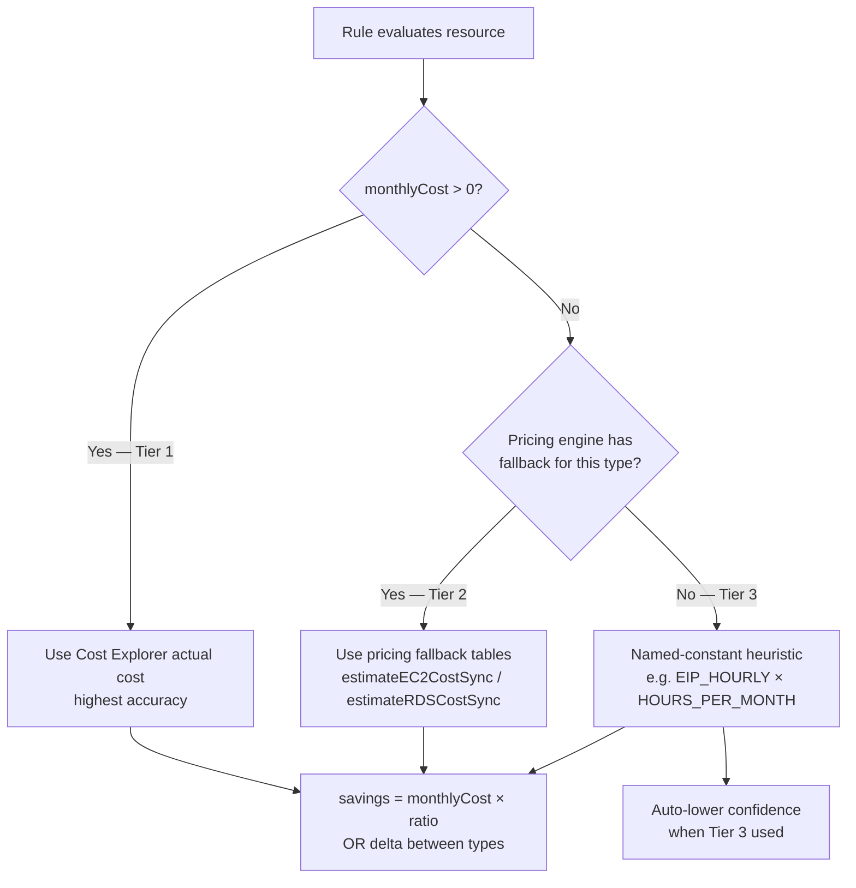

# Rules Reference

korinfra uses two deterministic rule systems to analyze your AWS infrastructure. Rules run **without AI** — they are pure functions that evaluate resources against known patterns and thresholds. AI enhances the output (natural language explanations, cross-resource correlation) but is not required for the rules themselves.

## Two Rule Systems

### Cost Optimization Rules (66 rules)

Cost rules evaluate live AWS resources and produce **recommendations** with estimated monthly savings.

```
Resource → rule function → Recommendation | null
```

Each cost rule is a pure function:

```typescript
(resource: Resource, thresholds: Thresholds) => Recommendation | null
```

The runner (`evaluateRules()` in `src/rules/index.ts`) iterates all resources × all rules, deduplicates by `(ruleId, resourceId)`, and quality-scores each recommendation.

**Savings accuracy — 3-tier system:**

1. **Tier 1 (Cost Explorer)** — when `monthlyCost` is populated from actual AWS cost data, savings are derived from it directly.
2. **Tier 2 (Pricing engine)** — when Cost Explorer data is absent, the pricing engine estimates cost from the resource config using fallback tables (`FALLBACK_EC2_PRICES`, `FALLBACK_RDS_PRICES`, etc.).
3. **Tier 3 (Named-constant heuristic)** — last resort multiplier, used only when pricing tables have no entry. Confidence is automatically reduced.

Recommendations with `confidence < 0.40` are suppressed entirely.

### Security Rules (46 rules)

Security rules evaluate **parsed Terraform resources** (HCL files) and produce **findings** with severity levels.

```
TfResource → rule.evaluate() → SecurityFinding[]
```

Security rules are classes implementing:

```typescript
{
  id: string;
  title: string;
  evaluate(resource: TfResource): SecurityFinding | null;
}
```

The runner (`evaluateSecurityRules()` in `src/rules/security/index.ts`) iterates all Terraform resources × all security rules.

### Confidence calibration (`confidenceFromUtilization`)

Every rule that reads `r.utilization` passes its base confidence through `confidenceFromUtilization(base, util)` before returning a recommendation. This function applies the following adjustments:

| Condition | Adjustment |
|---|---|
| `util` absent (struct not available) | no penalty — returns `base` unchanged |
| `dataPoints === 0` | cap at 0.45 |
| coverage ratio < 50% | cap at 0.55 |
| coverage ratio 50–75% | cap at 0.70 |
| `dataPoints < 30` | cap at 0.60 |
| `freshnessHrs > 48` | multiply by 0.80 |
| `period === '7d'` | multiply by 0.90 |
| `period === '30d'` AND coverage > 90% | multiply by 1.05 (bonus) |

Rules whose detection logic is purely structural (e.g., EBS-001 unattached volume, EBS-004 unencrypted) do not use `confidenceFromUtilization` — their signals are deterministic.

### Multi-metric gating for rightsize rules

CPU alone is not a reliable rightsizing signal — a low-CPU instance may have high memory, network, or I/O pressure. Three rightsize rules require corroborating signals:

| Rule | Primary signal | Additional gate | Confidence cap if borderline |
|---|---|---|---|
| EC2-004 | `cpuP95 < 30%` | `memoryAverage < 2000 MB` AND `networkOutMB < 100 000 MB` AND `diskIOPS < 5000` | 0.55 if `cpuP99 > threshold` (spike detected) |
| RDS-003 | `cpuAverage < 15%` | `connectionCount < threshold × 5` | 0.55 if `connectionCount ≥ 10`; 0.65 if `connectionCountMax > connectionCount × 3` |
| ELC-001 | `memoryAverage < 10%` | `cpuAverage < 10%` OR `connectionCount < 5` | — |

If `memoryAverage === 0` for EC2-004 (CloudWatch Agent not installed), a warning is appended and confidence is capped at 0.65.

---

## How Rules Work

### Execution Flow

```mermaid
flowchart LR
    subgraph Inputs
        AWS[AWS APIs] --> R[Resource[]]
        TF[Terraform HCL] --> TR[TfResource[]]
    end
    
    subgraph "Cost Rules Engine (deterministic)"
        R --> CR[66 cost rules]
        CR --> REC[Recommendation[]]
        REC --> POST[Dedup + quality score<br/>+ confidence filter]
    end
    
    subgraph "Security Rules Engine (deterministic)"
        TR --> SR[46 security rules]
        SR --> FIND[SecurityFinding[]]
    end
    
    POST --> OUT[(SQLite DB + TUI + report export)]
    FIND --> OUT
```

### 3-tier savings calculation



### Quality Scoring

Every cost recommendation is scored on 7 dimensions, clamped to a 0–100 scale. All thresholds are configurable via the `quality.*` section in `.korinfra/config.yaml`.

| Dimension | Max Points | What It Measures |
|-----------|-----------|-----------------|
| Clarity | 20 | Title in `[title_min_length, title_max_length]` (+10) + description tiers (+10/+6/+2) |
| Impact | 25 | `max(absolute, relative)` savings tier (+15/+12/+8/+4) + impact label (+10/+6/+2) |
| Evidence | 20 | reasoning ≥ `reasoning_full_length` (+10/+5) + `resourceId` (+5) + `currentConfig`/`suggestedConfig` non-empty (+5) + utilization metric pattern matched (+5) |
| Remediation | 15 | implementationSteps (+10) + patchContent (+5) |
| Confidence | 10 | `round(confidence × 10)` |
| Reversibility | 10 | Action-aware: irreversible (delete/terminate) → 0; reversible (stop/scale_down) → +6; risk fallback otherwise; +4 if `patchContent` (git-revertible) |
| Actionability | -3 to +10 | `filePath` + `suggestedConfig` (+5), smooth confidence ramp 0→`actionability_max_bonus` over `[actionability_confidence_threshold, 1.0]`, deletion (-3) |

**Impact = max(absolute, relative):** absolute uses USD tiers (`savings_tier_high/medium/low`). Relative uses `savings/currentCost` percentage (`savings_pct_high/medium`). Small AWS accounts where $10 saved on a $40 resource = 25% get a high relative score even though absolute savings are below the medium tier.

**Theoretical max before clamp:** 20+25+20+15+10+10+5+5 = 110. Clamping at 100 is intentional — recommendations excelling on every dimension all top out together; sort uses qualityScore desc.

**Confidence floor:** recommendations below `min_confidence_threshold` (default 0.40) are dropped during evaluation as not actionable.

Higher scores indicate more reliable, actionable recommendations. Scores drive ranking and deduplication.

### Deduplication

When the same rule fires on the same resource (e.g., from both a live scan and a Terraform parse), the runner keeps the recommendation with the **higher quality score**. Recommendations are pre-sorted by quality score before deduplication so the best result always wins.

### Conflict suppression

Some rule pairs are mutually exclusive on the same resource. When both would fire, the lower-priority rule is suppressed to avoid contradictory recommendations:

| Suppressed rule | Suppressed by | Rationale |
|---|---|---|
| EC2-004 (rightsize) | EC2-001 (idle) | If an instance is idle, rightsizing is moot — stop or terminate it instead |
| RDS-003 (rightsize) | RDS-001 (idle) | Same logic — idle DB should be stopped, not downsized |

The highest-quality recommendation (by `qualityScore`) per `(ruleId, resourceId)` pair always wins deduplication.

---

## Complete Cost Rule Reference (66 rules)

### EC2 (13 rules)

| ID | Title | Impact | Risk | Description |
|----|-------|--------|------|-------------|
| EC2-001 | Idle EC2 instance | high | medium | EC2 instance with <5% average CPU over 7+ days |
| EC2-002 | Stopped EC2 with attached EBS | medium | low | Stopped instance older than 7 days with billable EBS volumes |
| EC2-003 | Previous-generation instance family | medium | low | Instance family has a cheaper, faster current-gen replacement |
| EC2-004 | Oversized EC2 instance | high | low | CPU P95 < 30% — instance can be rightsized to a smaller type |
| EC2-005 | On-demand instance running 30+ days | high | medium | Long-running on-demand instance eligible for Reserved Instance / Savings Plan |
| EC2-006 | EC2 instance eligible for Graviton migration | medium | low | x86_64 instance family has an equivalent Graviton arm64 family (~20% cheaper) |
| EC2-007 | t2 instance should be upgraded to t3/t3a | low | low | t3 is cheaper and faster than t2 with unlimited burst mode by default |
| EC2-008 | Previous-generation instance type (broad set) | medium | low | Instance family (t1/m1-m4/c1/c3-c4/r3-r4/i2/d2/g2/p2/x1) has a current-gen replacement |
| EC2-009 | Stopped EC2 still incurring EBS charges | medium | low | Stopped instance has attached EBS volumes that continue to be billed |
| EC2-010 | EC2 with high outbound data transfer | medium | low | High outbound transfer (>1 TB/mo) — consider CloudFront or VPC endpoints |
| EC2-011 | EC2 without EBS optimization enabled | medium | low | Non-burstable EC2 instance without EBS optimization loses throughput |
| EC2-012 | EC2 without IMDSv2 enforced | high | low | Instance metadata service v1 is a common attack vector |
| EC2-013 | EC2 running for more than 1 year | low | low | Long-running instances should be periodically reviewed |

### EBS / Snapshots (9 rules)

| ID | Title | Impact | Risk | Description |
|----|-------|--------|------|-------------|
| EBS-001 | Unattached EBS volume | high | low | EBS volume in 'available' state not attached to any instance |
| EBS-002 | Old EBS snapshot (>90 days) | low | low | Snapshot older than 90 days unlikely needed for recovery |
| EBS-003 | gp2 volume should be gp3 | medium | low | gp3 is 20% cheaper with same or better baseline performance |
| EBS-004 | Unencrypted EBS volume | high | medium | Encryption-at-rest is free and required by most compliance frameworks |
| EBS-005 | io1/io2 with low IOPS — gp3 is sufficient | high | low | Provisioned IOPS <= 3000 can be served by gp3 baseline at much lower cost |
| EBS-006 | io1/io2 with over-provisioned IOPS (>3000) | medium | low | io1/io2 IOPS cost $0.065/IOPS/month — verify actual usage in CloudWatch and reduce if over-provisioned |
| EBS-007 | gp3 with very low IOPS utilization | medium | low | gp3 volume with provisioned IOPS above baseline but very low actual usage |
| SNAP-001 | Orphaned EBS snapshot | low | low | Snapshot whose source volume no longer exists |
| SNAP-002 | EBS snapshot older than 1 year | medium | low | Snapshot over 1 year old — review and delete |

### EIP (1 rule)

| ID | Title | Impact | Risk | Description |
|----|-------|--------|------|-------------|
| EIP-001 | Unused Elastic IP | low | low | EIP not associated with a running instance costs $3.65/mo |

### RDS (14 rules)

| ID | Title | Impact | Risk | Description |
|----|-------|--------|------|-------------|
| RDS-001 | Idle RDS instance | high | medium | Near-zero CPU for 7+ days — forgotten staging/dev database |
| RDS-002 | Production RDS without Multi-AZ | high | low | Single-AZ RDS has no automatic failover |
| RDS-003 | Oversized RDS instance | high | medium | CPU average < 15% — instance class can be reduced |
| RDS-004 | Unencrypted RDS storage | high | high | Unencrypted RDS storage is a compliance and security risk |
| RDS-005 | Publicly accessible RDS instance | high | low | publicly_accessible=true exposes the database to the internet |
| RDS-006 | RDS gp2 storage should be gp3 | medium | low | gp3 storage is 20% cheaper than gp2 |
| RDS-007 | Multi-AZ in non-production | high | low | Dev/staging databases do not need Multi-AZ — disabling halves cost |
| RDS-008 | RDS eligible for Graviton migration | medium | low | db.m5/r5/m6i/r6i have Graviton equivalents 10-20% cheaper |
| RDS-009 | Idle RDS by connection count | high | medium | Fewer than 1 average connection over 7+ days |
| RDS-010 | Reserved Instance opportunity for stable RDS | high | low | Stable workload running 30+ days — 1-year RI saves ~40% |
| RDS-011 | RDS without automated backups | high | low | No automated backups means no point-in-time recovery |
| RDS-012 | RDS Extended Support surcharge | medium | medium | Older engine versions incur AWS Extended Support charges |
| RDS-013 | RDS with low storage utilization | medium | low | >70% free storage — consider reducing allocated storage |
| RDS-014 | RDS engine approaching Extended Support | medium | medium | Engine version enters AWS Extended Support within 180 days ($0.12+/vCPU/hr) |

### S3 (4 rules)

| ID | Title | Impact | Risk | Description |
|----|-------|--------|------|-------------|
| S3-001 | S3 bucket without lifecycle policy | medium | low | Buckets without lifecycle rules miss tiering savings |
| S3-002 | S3 without lifecycle or Intelligent-Tiering | low | low | Add lifecycle rule with Intelligent-Tiering transition — Monitoring fee subtracted: `(objectCount / 1000) × $0.0025/mo` — rule suppressed if net savings ≤ 0 |
| S3-003 | S3 bucket without versioning | medium | low | Versioning prevents accidental deletion and overwrites |
| S3-004 | S3 without server-side encryption | high | low | SSE-S3 is free — no reason not to enable |

### Lambda (7 rules)

| ID | Title | Impact | Risk | Description |
|----|-------|--------|------|-------------|
| LAM-001 | Unused Lambda function | low | low | Function with zero invocations adds maintenance overhead |
| LAM-002 | Overprovisioned Lambda memory | medium | low | Lambda using <20% of allocated memory — savings calculated from actual invocations × duration when available |
| LAM-003 | Deprecated Lambda runtime | high | medium | End-of-life runtimes receive no security patches |
| LAM-004 | Low-invocation Lambda with high memory | medium | low | <100 invocations/month but >512 MB memory |
| LAM-005 | Lambda on x86_64 — consider arm64 | medium | low | arm64 (Graviton2) is ~20% cheaper |
| LAM-006 | Lambda with high error rate | high | low | Lambda function with >10% error rate |
| LAM-007 | Lambda runtime approaching end of support | high | medium | Runtime will be unsupported within 180 days — no security patches |

### DynamoDB (2 rules)

| ID | Title | Impact | Risk | Description |
|----|-------|--------|------|-------------|
| DDB-001 | DynamoDB provisioned capacity at low utilisation | high | low | Switch to on-demand to pay only for actual requests |
| DDB-002 | DynamoDB provisioned without auto-scaling | medium | low | Wastes capacity during off-peak hours |

### ElastiCache (3 rules)

| ID | Title | Impact | Risk | Description |
|----|-------|--------|------|-------------|
| ELC-001 | Overprovisioned ElastiCache cluster | medium | medium | <10% memory utilisation — rightsize to smaller node type |
| ELC-002 | Previous-generation ElastiCache node type | medium | low | Previous-gen node type has a cheaper Graviton replacement |
| ELC-003 | Idle ElastiCache cluster | high | medium | Near-zero CPU and memory usage |

### NAT Gateway (2 rules)

| ID | Title | Impact | Risk | Description |
|----|-------|--------|------|-------------|
| NET-001 | Low-traffic NAT Gateway | medium | medium | <1 GB/mo — fixed hourly cost dominates; consider NAT instance |
| NAT-001 | NAT Gateway with very low data | medium | low | <5 GB/mo — VPC endpoints for S3/DynamoDB eliminate NAT charges |

### ECS (4 rules)

| ID | Title | Impact | Risk | Description |
|----|-------|--------|------|-------------|
| ECS-001 | ECS service with 0 running tasks | medium | low | Idle ECS service still holds cluster capacity |
| ECS-002 | ECS service on EC2 launch type | medium | medium | Fargate eliminates EC2 management overhead — only recommended when Fargate is cheaper |
| ECS-003 | ECS service over-provisioned | medium | medium | High desired count but very low CPU utilization — savings calculated as `min(reductionRatio, cfg.ecsOverProvisionedSavingsMultiplier)` — tied to actual task reduction |
| ECS-004 | ECS service degraded — running below desired count | high | low | Service has fewer running tasks than desired with no pending tasks — likely a launch failure |

### ELB (4 rules)

| ID | Title | Impact | Risk | Description |
|----|-------|--------|------|-------------|
| ELB-001 | Load balancer with 0 healthy targets | medium | low | Idle load balancer still accrues hourly charges |
| LB-002 | Idle load balancer (no healthy targets or negligible traffic) | medium | low | 0 healthy targets or <0.1 MB network in 7+ days |
| ELB-002 | Classic Load Balancer in use | medium | medium | CLB is previous-gen — ALB/NLB offer better features/pricing |
| ELB-003 | ALB without HTTPS listener | high | low | Application Load Balancer serving only HTTP |

### General (3 rules)

| ID | Title | Impact | Risk | Description |
|----|-------|--------|------|-------------|
| TAG-001 | Missing cost allocation tags | low | low | Resources without Environment/Team/Project tags |
| TAG-002 | Completely untagged resource | low | low | Resource has no tags at all |
| GENERAL-001 | Resource in expensive region | medium | high | Same workload can run in us-east-1 at ~10-20% lower cost |

---

## Complete Security Rule Reference (46 rules)

### S3 Security (6 rules)

| ID | Title | Severity | Description |
|----|-------|----------|-------------|
| S3-SEC-001 | S3 bucket with public ACL | critical | Bucket has a public ACL allowing unrestricted access |
| S3-SEC-002 | S3 bucket without encryption | high | Bucket does not have server-side encryption configured |
| S3-SEC-003 | S3 bucket without versioning | medium | Bucket does not have versioning enabled |
| S3-SEC-004 | S3 bucket without logging | medium | Bucket does not have access logging enabled |
| S3-SEC-005 | S3 bucket missing public access block | high | Bucket does not have `aws_s3_bucket_public_access_block` with all four block settings enabled |
| S3-SEC-006 | S3 bucket policy grants public access | critical | Bucket policy allows public `s3:GetObject` or `s3:*` access |

### IAM Security (4 rules)

| ID | Title | Severity | Description |
|----|-------|----------|-------------|
| IAM-SEC-001 | IAM policy with wildcard actions | critical | Policy allows all actions (`*`) — overly permissive |
| IAM-SEC-002 | IAM policy with wildcard resources | high | Policy applies to all resources (`*`) — overly permissive |
| IAM-SEC-003 | IAM role with wildcard Principal in trust policy | critical | Trust policy allows any principal (`*`) to assume the role |
| IAM-SEC-004 | IAM policy uses NotAction (implicit allow-all) | critical | `NotAction` implicitly allows every action except those listed — overly permissive |

### EC2 & Security Groups (8 rules)

| ID | Title | Severity | Description |
|----|-------|----------|-------------|
| EC2-SEC-001 | EC2 instance without IMDSv2 | high | IMDSv1 remains enabled, increasing metadata-exfiltration risk |
| EC2-SEC-002 | EC2 instance with hardcoded credentials | critical | Credential-like values detected in user data or launch template content |
| EC2-SEC-004 | EC2 instance uses deprecated instance type | medium | Legacy instance families increase operational and security risk |
| SG-SEC-001 | Security group allows ingress from 0.0.0.0/0 | critical | Unrestricted inbound traffic from the internet |
| SG-SEC-002 | Security group allows SSH from 0.0.0.0/0 | critical | SSH (port 22) is open to the entire internet |
| SG-SEC-003 | Security group allows RDP from 0.0.0.0/0 | critical | RDP (port 3389) is open to the entire internet |
| SG-SEC-004 | Security group allows all egress | low | Unrestricted outbound traffic |
| SG-SEC-005 | Security group exposes database port to internet | critical | Port 3306/5432/1433/27017/6379 open to 0.0.0.0/0 |

### RDS Security (4 rules)

| ID | Title | Severity | Description |
|----|-------|----------|-------------|
| RDS-SEC-001 | RDS instance publicly accessible | critical | RDS instance accessible from the internet |
| RDS-SEC-002 | RDS instance not encrypted | high | Storage encryption not enabled |
| RDS-SEC-003 | RDS instance without backup | high | Backup retention set to 0 |
| RDS-SEC-004 | RDS instance without deletion protection | medium | Deletion protection not enabled — instance can be removed without safeguard |

### Encryption (9 rules)

| ID | Title | Severity | Description |
|----|-------|----------|-------------|
| EBS-SEC-001 | EBS volume not encrypted | high | EBS volume does not have encryption enabled |
| KMS-SEC-001 | KMS key without rotation | medium | Automatic key rotation not enabled |
| SNS-SEC-001 | SNS topic without encryption | medium | Server-side encryption not configured |
| SQS-SEC-001 | SQS queue without encryption | medium | Server-side encryption not configured |
| DDB-SEC-001 | DynamoDB table without point-in-time recovery | high | PITR not enabled, reducing recovery options |
| DDB-SEC-002 | DynamoDB table without encryption at rest using CMK | medium | Customer-managed key encryption not configured |
| EC-SEC-001 | ElastiCache replication group without encryption in transit | high | Transit encryption not enabled |
| EC-SEC-002 | ElastiCache replication group without encryption at rest | high | At-rest encryption not enabled |
| SM-SEC-001 | Secrets Manager secret without customer-managed KMS key | medium | Secret is encrypted with the default AWS-managed key, not a CMK |

### Lambda Security (4 rules)

| ID | Title | Severity | Description |
|----|-------|----------|-------------|
| LAMBDA-SEC-001 | Lambda function without dead letter queue | medium | No DLQ configured for failed invocations |
| LAMBDA-SEC-002 | Lambda function in VPC without security group | medium | Running in VPC but no security group attached |
| LAM-SEC-001 | Lambda function without VPC configuration | medium | Function not configured to run inside a VPC |
| LAM-SEC-002 | Lambda function with hardcoded credentials in environment variables | critical | Credential-like values detected in environment variables |

### Network Security (2 rules)

| ID | Title | Severity | Description |
|----|-------|----------|-------------|
| NET-SEC-001 | VPC may not have flow logs enabled | low | VPC without flow log configuration |
| NET-SEC-002 | Subnet with public IP auto-assign enabled | medium | Subnet automatically assigns public IPs to instances |

### Miscellaneous Security (9 rules)

| ID | Title | Severity | Description |
|----|-------|----------|-------------|
| CW-SEC-001 | CloudWatch log group without encryption | medium | No KMS encryption configured |
| CW-SEC-002 | CloudWatch log group without retention | medium | Logs kept forever (no retention policy) |
| LB-SEC-001 | Load balancer without access logging | medium | Access logging not enabled |
| LB-SEC-002 | Load balancer listener using HTTP | high | Using HTTP instead of HTTPS |
| EKS-SEC-001 | EKS cluster endpoint publicly accessible | high | API endpoint accessible from public internet |
| ECS-SEC-001 | ECS task definition without read-only root filesystem | medium | Container root filesystem is writable |
| SSM-SEC-001 | SSM Parameter with sensitive name stored as plaintext | high | Parameter name matches sensitive patterns (password, secret, key, token) but type is `String`, not `SecureString` |
| TAG-SEC-001 | Resource missing required tags | low | Missing required tags (Environment, Team, Project) — configurable via `scan.required_tags` |
| GEN-SEC-001 | Resource without tags | low | No tags configured at all |

---

## Configurable Thresholds

Rules use thresholds that can be overridden in your `.korinfra/config.yaml` config:

| Threshold | Default | What It Controls |
|-----------|---------|-----------------|
| `scan.idle_cpu_threshold` | 5 (%) | **EC2** CPU below this = idle (RDS uses separate `rds_idle_cpu_threshold`, default 1%) |
| `scan.rightsize_cpu_threshold` | 30 (%) | **EC2** CPU P95 below this = oversized (RDS uses `rds_rightsize_cpu_threshold`, default 15%, average not P95) |
| `scan.rds_idle_cpu_threshold` | 1 (%) | RDS CPU below this = idle |
| `scan.rds_rightsize_cpu_threshold` | 15 (%) | RDS CPU below this = oversized |
| `scan.stopped_instance_days` | 7 (days) | Stopped EC2 older than this triggers EBS warning |
| `scan.snapshot_retention_days` | 90 (days) | Snapshots older than this are flagged |
| `scan.lambda_low_invocations` | 100 | Lambda with fewer invocations than this is flagged |
| `scan.cache_memory_threshold` | 10 (%) | ElastiCache memory below this = idle |
| `scan.gp3_iops_baseline` | 3000 | EBS gp3 IOPS baseline for rightsizing |
| `scan.required_tags` | `['Environment', 'Team', 'Project']` | Tags that must be present for compliance |

See [Configuration](configuration.md) for the full list of tunable thresholds (RDS RI cost, ECS CPU, Lambda memory, ELB traffic, etc.) and `scan.savings_multipliers` for adjusting savings estimate ratios per recommendation type.

Example override in `.korinfra/config.yaml`:

```yaml
scan:
  idle_cpu_threshold: 10      # More aggressive idle detection
  rightsize_cpu_threshold: 40
  required_tags:
    - Environment
    - Team
    - Project
```

## CLI reference

The cost rule catalog is exposed through the headless CLI for scripting and CI/CD use:

```bash
# Human-readable catalog, grouped by category
korinfra rules list

# Machine-readable JSON (CI/CD-friendly — no TTY required)
korinfra rules list --json

# Filter by category or id-prefix
korinfra rules list --filter ec2          # all 14 EC2-category rules
korinfra rules list --filter ebs          # ebs category — includes SNAP-* rules
korinfra rules list --filter LAM          # id-prefix match

# Filter by impact / risk severity
korinfra rules list --impact high         # high-impact rules only
korinfra rules list --risk medium         # medium-risk rules only
korinfra rules list --impact high --filter ec2   # combine
```

**JSON shape:**

```json
{
  "command": "rules list",
  "status": "completed",
  "summary": { "total": 66, "totalAllRules": 66 },
  "total": 66,
  "rules": [
    {
      "id": "EC2-001",
      "category": "ec2",
      "title": "Idle EC2 instance",
      "description": "EC2 instance with <5% average CPU over 7+ days",
      "impact": "high",
      "risk": "medium"
    }
  ],
  "next": [{ "label": "run rules against AWS", "command": "korinfra scan" }]
}
```

**Common CI/CD checks:**

```bash
# Fail the pipeline if a required rule is missing from the binary
korinfra rules list --json \
  | jq -e '.rules[] | select(.id == "EC2-012")' > /dev/null \
  || { echo "EC2-012 rule missing — aborting"; exit 1; }

# Count rules per category for a dashboard
korinfra rules list --json | jq '[.rules[] | .category] | group_by(.) | map({(.[0]): length}) | add'

# Re-generate this file's rule list from the binary's own output
korinfra rules list --json | jq '.rules[] | "- **\(.id)** \(.title)"' -r
```

**Notes:**

- `--filter` matches case-insensitively against category (exact) or id-prefix.
- `--impact` and `--risk` accept `low`, `medium`, or `high`. Other values exit with code 2.
- The `total` field is mirrored at top-level and under `summary.total` for compatibility with both the issue #25 proposal and the rest of korinfra's JSON envelopes.
- `--filter=ec2` (equals form) is not parsed today — use `--filter ec2` (space-separated). This is a project-wide flag-parsing convention.
- Security rules are not in this catalog. Run `korinfra security --json --dir <terraform-path>` to enumerate findings against your `.tf` files.
