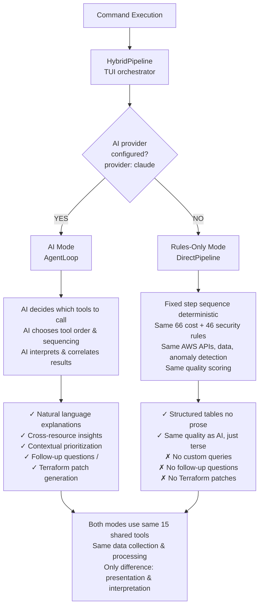

# Workflow & Architecture

This document explains how korinfra processes your AWS infrastructure — from data collection through analysis to actionable output.

## Three Execution Modes

korinfra operates in three modes:

### 1. Interactive TUI Mode (default)

Run `korinfra` with no arguments to get the interactive menu where you can pick commands.

### 2. Direct Command Mode

Run a specific command directly: `korinfra scan`, `korinfra costs`, etc.

### 3. MCP Server Mode

Run `korinfra serve` for IDE integration (Claude Code, Cursor, etc.).

---

## Two Pipeline Types

Modes 1 & 2 use one of two execution pipelines depending on your AI provider configuration:



**When to use each:**

| Mode | Use case | Cost |
|------|----------|------|
| **AI Mode** | Complex accounts, you want insights and suggestions | $0.01–$0.50 per query |
| **Rules-Only** | Simple accounts, high-volume scanning, zero API costs | $0.00 |

---

## Full Scan Workflow

The `scan` command is the primary workflow. Here's the step-by-step process:

```mermaid
flowchart TD
    START["korinfra scan"]
    
    START --> S1["Step 1: Collect AWS Resources<br/>parallel collection"]
    S1 --> S1_LIST["EC2 instances, volumes, snapshots, EIPs<br/>RDS instances & clusters<br/>S3 buckets encryption, versioning, lifecycle<br/>Lambda functions & invocation count<br/>ECS clusters & services<br/>ELB / ALB load balancers<br/>ElastiCache clusters<br/>DynamoDB tables<br/>NAT Gateways"]
    
    S1_LIST --> S2["Step 2: Fetch CloudWatch Metrics<br/>14-day window"]
    S2 --> S2_LIST["CPU utilization<br/>Memory usage<br/>Network traffic<br/>RDS connections, Lambda invocations"]
    
    S2_LIST --> S3["Step 3: Fetch AWS Cost Explorer<br/>30-day daily breakdown"]
    S3 --> S3_LIST["By service EC2, RDS, S3, etc.<br/>By region"]
    
    S3_LIST --> S4["Step 4: Evaluate Rules<br/>pure logic, no AWS calls"]
    S4 --> S4_LIST["66 cost optimization rules<br/>46 security rules<br/>4-pass Terraform matcher<br/>Quality scoring & deduplication"]
    
    S4_LIST --> S5["Step 5: Detect Anomalies"]
    S5 --> S5_LIST["Z-score anomaly detection<br/>rolling 14-day window<br/>Linear regression cost forecast"]
    
    S5_LIST --> S6["Step 6: Save to SQLite"]
    S6 --> S6_LIST["Scan metadata ID, timestamp, resource count<br/>All resources with metrics & tags<br/>Cost breakdown by service, region<br/>All recommendations scored<br/>Anomalies & trends"]
    
    S6_LIST --> S7["Step 7: Output"]
    S7 --> S7_LIST["Terminal TUI interactive, scrollable<br/>JSON export<br/>CSV export<br/>HTML+SVG report"]
```



### Step 1: Collect AWS Resources

The collector (`src/aws/collector.ts`) calls 9 AWS APIs in parallel:

| Collector | AWS API | What It Returns |
|-----------|---------|----------------|
| EC2 | `DescribeInstances`, `DescribeVolumes`, `DescribeAddresses`, `DescribeSnapshots` | Instance state, type, EBS volumes, Elastic IPs |
| RDS | `DescribeDBInstances` | Engine, class, storage, Multi-AZ status |
| S3 | `ListBuckets` + `GetBucketEncryption` + `GetBucketLifecycleConfiguration` | Bucket config, encryption, lifecycle |
| ELB | `DescribeLoadBalancers` + `DescribeTargetHealth` | Load balancers, healthy target count |
| Lambda | `ListFunctions` + `GetResources` (tagging API) | Runtime, memory, timeout, tags |
| ECS | `ListClusters` + `DescribeServices` | Clusters, services, task counts |
| ElastiCache | `DescribeCacheClusters` | Node type, engine, memory utilization |
| DynamoDB | `ListTables` + `DescribeTable` | Billing mode, capacity settings, auto-scaling |
| NAT Gateway | `DescribeNatGateways` | Data processed, connectivity type |
| Cost Explorer | `GetCostAndUsage` | Daily/monthly costs by service |
| CloudWatch | `GetMetricData`, `GetMetricStatistics` | CPU, memory, connections, invocations |

All API calls are rate-limited (`p-throttle`) with exponential backoff and jitter.

### Step 2: Evaluate Rules

The 66 cost rules run against every collected resource. Each rule is a pure function:

```typescript
function ec2IdleRule(resource: Resource, thresholds: Thresholds): Recommendation | null {
  if (resource.type !== 'ec2') return null;
  if (resource.metrics?.cpuAvg > thresholds.idle_cpu_threshold) return null;
  return {
    id: 'EC2-001',
    title: 'Idle EC2 instance',
    estimated_savings: resource.monthlyCost,
    // ...
  };
}
```

After evaluation:

1. **Deduplication**: Same rule + same resource → keep higher quality score
2. **Quality scoring**: 7 dimensions, 0-100 scale (see [rules.md](./rules.md))
3. **Filtering**: Recommendations with confidence < 0.40 are dropped

### Step 3: Get Costs

Queries AWS Cost Explorer for the last 30 days:

- Daily granularity for trend analysis
- Grouped by service for cost breakdown
- Grouped by region for geographic analysis

### Step 4: Detect Anomalies

Uses z-score anomaly detection on daily cost data:

- Calculates mean and standard deviation per service
- Flags days where cost > mean + 2σ
- Applies linear regression for trend forecasting

### Step 5: Save Scan

Persists all results to `.korinfra/data.db` (SQLite with WAL mode):

- Resources with their metadata and tags
- Cost entries with service/region breakdown
- Recommendations with quality scores and status
- Scan metadata (timestamp, resource count, total cost)

This enables:

- `korinfra history` — view past scans
- `korinfra recommend` — browse saved recommendations
- `korinfra fix` — apply recommendations
- `korinfra report` — export to JSON/CSV/HTML

---

## Command → Tool Mapping

| Command | Tools Used | Works Without AI? |
|---------|-----------|-------------------|
| `scan` | collect_aws_resources, evaluate_rules, get_costs, detect_cost_anomalies, save_scan | **Yes** — full pipeline, output as tables |
| `costs` | get_costs, detect_cost_anomalies | **Yes** — cost breakdown + anomalies |
| `resources` | collect_aws_resources, evaluate_rules | **Yes** — resource inventory table |
| `security` | scan_security, scan_terraform | **Yes** — Terraform security scan |
| `recommend` | (reads from DB) | **Yes** — shows saved recommendations |
| `recommend --refresh` | collect_aws_resources, evaluate_rules, get_costs, detect_cost_anomalies, save_scan | **No** — AI required for fresh analysis |
| `history` | (reads from DB) | **Yes** — list/show/diff scans |
| `tags list` | collect_aws_resources | **Yes** — tag compliance check |
| `tags suggest` | collect_aws_resources, get_costs | **No** — AI suggests tag values |
| `report` | (reads from DB) | **Yes** — export to JSON/CSV/HTML |
| `fix` | scan_terraform, terraform_validate, apply_recommendation, create_github_pr | **No** — AI generates and applies Terraform patches |
| `init` | — | **Yes** — configuration wizard |
| `doctor` | — | **Yes** — diagnostic checks |
| `config` | — | **Yes** — view/edit config |
| `pricing` | — | **Yes** — AWS pricing lookup |
| `serve` / `mcp` | — | **Yes** — MCP server mode |

---

## AI vs Rules-Only: What You Get

| Capability | With AI | Without AI |
|-----------|---------|------------|
| Data collection | Same AWS APIs, same data | Same |
| Rule evaluation | Same 66 cost + 46 security rules | Same |
| Cost anomaly detection | Same z-score algorithm | Same |
| Quality scoring | Same 7-dimension scoring | Same |
| **Output quality** | Natural language explanations with context | Structured tables and numbers only |
| **Prioritization** | AI understands your specific context, groups related findings | Mechanical sort by impact/savings |
| **Custom queries** | `/` prompt — ask anything about your infra | Not available |
| **Fix generation** | AI generates Terraform patches + GitHub PRs | Not available — manual fix only |
| **Follow-up questions** | Conversational follow-ups after scan | Not available |
| **Cross-resource insight** | "These 3 instances share the same pattern" | Each resource evaluated independently |
| **Cost** | AI API costs per query | $0.00 — no API costs |

---

## Tool Inventory

korinfra registers 15 MCP tools shared between AI mode and MCP server mode:

| Tool | Description | Deterministic? | AWS APIs |
|------|-------------|---------------|----------|
| `collect_aws_resources` | Inventory EC2, RDS, S3, ELB, Lambda, ECS (+ ElastiCache, DynamoDB, NAT) | Yes | EC2, RDS, S3, ELB, Lambda, ECS, ElastiCache, DynamoDB, CloudWatch |
| `get_costs` | Query AWS Cost Explorer | Yes | Cost Explorer |
| `evaluate_rules` | Run 66 cost optimization rules | Yes | None (pure logic) |
| `detect_cost_anomalies` | Z-score anomaly detection on cost data | Yes | None (pure logic) |
| `scan_terraform` | Parse Terraform HCL files | Yes | None (local files) |
| `scan_security` | Run 46 security rules on Terraform | Yes | None (pure logic) |
| `classify_resources` | Match Terraform vs AWS resources (4-pass), classify Scenario A/B/C | Yes | None (pure logic) |
| `save_scan` | Persist scan results to SQLite | Yes | None (local DB) |
| `get_history` | Read scan history from SQLite | Yes | None (local DB) |
| `compare_scans` | Diff two scan records | Yes | None (local DB) |
| `get_recommendations` | Read recommendations from SQLite | Yes | None (local DB) |
| `list_rules` | List all registered rules | Yes | None (pure logic) |
| `apply_recommendation` | Mark recommendation as applied | Yes | None (local DB) |
| `terraform_validate` | Run `terraform validate -json` (syntax + schema check) | Yes | Terraform CLI |
| `create_github_pr` | Create GitHub Pull Request with fix details and savings estimate | Yes | GitHub API |

All 15 tools are deterministic (same input → same output). The AI adds interpretation, not data.

---

## Configuration Impact on Rules

The `scan` section in `.korinfra/config.yaml` controls rule behavior:

```yaml
scan:
  # Thresholds that affect rule triggers
  idle_cpu_threshold: 5        # EC2-001, RDS-001: CPU below this = idle
  rightsizing_cpu_threshold: 30 # EC2-004, RDS-003: CPU P95 below this = oversized
  stopped_days_threshold: 7     # EC2-002, EC2-009: stopped instances older than this
  snapshot_age_days: 90         # EBS-002: snapshots older than this
  lambda_unused_days: 30        # LAM-001: zero invocations in this period
  
  # Tag compliance
  required_tags:                # TAG-001, TAG-SEC-001: must be present
    - Environment
    - Team
    - Project
  
  # Resource filters
  regions: []                   # Empty = all regions. Set to filter specific regions
  skip_services: []             # Skip specific AWS services in collection
```

Lower thresholds = more aggressive detection (more findings).
Higher thresholds = fewer findings, only clear waste.
